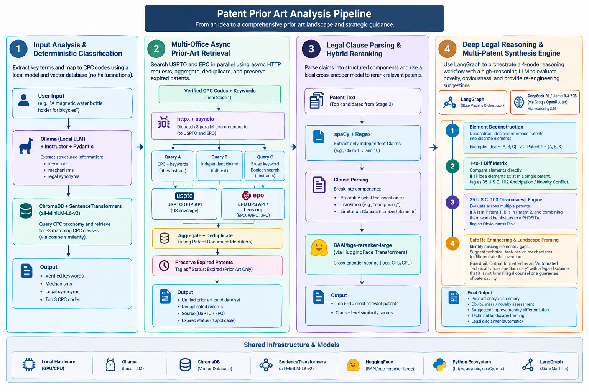

# AI Patent Agent Blueprint

An automated, local prior-art analysis agent that extracts technical concepts from an invention idea, searches global patent databases, parses independent claims, and builds a non-infringement element diff matrix and obviousness check using local LLMs via Ollama.

---

## 🛠️ Tech Stack & Prerequisites

* **Local LLM Engine:** [Ollama](https://ollama.com/) running `llama3.3:70b` or `deepseek-r1` for reasoning, and `llama3.1:8b` for fast extraction.
* **Orchestration:** LangGraph (State Machine for multi-node reasoning).
* **Extraction & Structuring:** `instructor` + `pydantic`.
* **Vector Database:** `chromadb` + `sentence-transformers` (`all-MiniLM-L6-v2`).
* **HTTP & Parsing:** `httpx` (async requests), `spacy` + Regex (claim parsing).
* **APIs:** USPTO Open Data Portal API, EPO Open Patent Services (OPS) API / Lens.org API.

---

## 🏗️ Architecture Overview

---

## 🚀 Step-by-Step Implementation Guide

### Step 1: Term Extraction & Local CPC Vector Search

#### 1. Input Parsing
* **Tool:** Ollama (`llama3.1:8b`) via `instructor` and `pydantic`.
* **Mechanism:** Map informal user descriptions into formal patent attorney terminology and technical mechanisms.
* **Why:** Avoids passing conversational text to search endpoints and ensures deterministic output structures.

#### 2. Deterministic Classification
* **Tool:** Local `ChromaDB` initialized with official CPC (Cooperative Patent Classification) descriptions, vectorized with `SentenceTransformers` (`all-MiniLM-L6-v2`).
* **Mechanism:** Query the vector index using extracted concepts to retrieve top matching CPC classes via cosine similarity.
* **Why:** Completely eliminates LLM classification hallucinations that break API requests.

---

### Step 2: Parallel Hybrid Prior-Art Retrieval

* **Tools:** `httpx` + `asyncio` querying USPTO ODP API and EPO OPS / Lens.org API.
* **Mechanism:** Execute non-blocking, parallel API calls across distinct search strategies:
  * **Strategy A:** Title/Abstract search matching verified CPC codes + core keywords.
  * **Strategy B:** Independent claim full-text search matching technical mechanisms.
  * **Strategy C:** Broad keyword Boolean search across abstracts.
* **Handling Expired Patents:** Aggregate candidates and deduplicate using Patent Publication IDs. Retain expired patents and tag them as `Expired - Prior Art Only`.
* **Why:** Incorporates international prior art beyond US borders and preserves expired patents required for novelty evaluations under 35 U.S.C. 102.

---

### Step 3: Legal Clause Parsing & Hybrid Reranking

#### 1. Structural Claim Splitting
* **Tools:** `spaCy` + Custom Legal Regex rules.
* **Mechanism:** Extract **Independent Claims** (e.g., Claim 1, Claim 10) while ignoring dependent claims. Parse claims into structural components:
  * Preamble
  * Transition (`comprising`, `consisting of`)
  * Limitation Clauses (individual features)

#### 2. Local Semantic Reranking
* **Tools:** `BAAI/bge-reranker-large` via HuggingFace `transformers` (executed locally).
* **Mechanism:** Rerank parsed independent claim clauses against the user's idea and select the top 5–10 reference patents.
* **Why:** Eliminates rate limits and external API costs while avoiding context clipping on long claims.

---

### Step 4: Multi-Node Reasoning & Obviousness Check

* **Framework:** `LangGraph` state machine.
* **Model:** Ollama (`llama3.3:70b` or `deepseek-r1`).

#### LangGraph State Nodes:

1. **Node 1: Element Deconstruction**
   Deconstruct both the user's idea and top reference claims into discrete logical elements:
   $$\text{Idea} = \{A, B, C\} \quad \text{vs.} \quad \text{Patent 1} = \{A, B, X\}$$

2. **Node 2: Non-Infringement Diff Matrix (35 U.S.C. 102)**
   Generate an Element Match Matrix comparing overlapping features and highlighting missing elements to flag single-patent anticipation conflicts.

3. **Node 3: Obviousness Engine (35 U.S.C. 103)**
   Evaluate multi-patent combinations (e.g., Feature $A$ in Patent 1 + Feature $B$ in Patent 2) to determine if the combination would be obvious to a person having ordinary skill in the art (PHOSITA).

4. **Node 4: Landscape Framing & Safe Re-Engineering**
   Highlight gaps in the prior art landscape and suggest technical mechanisms to differentiate the invention.
   
> **Important:** All generated outputs must automatically append an explicit system disclaimer stating that the output is an *Automated Technical Prior-Art Landscape Summary* and does not constitute formal legal counsel.

---